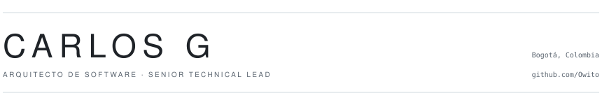
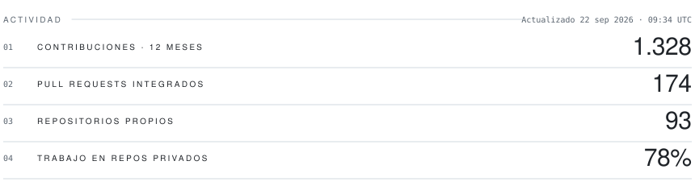
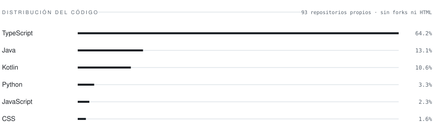

<picture>
  <source media="(prefers-color-scheme: dark)" srcset="assets/cover-es-dark.svg">
  
</picture>

Español · <a href="README_EN.md">English</a>

Diseño y llevo a producción sistemas distribuidos sobre Azure, con automatización basada en IA. Vengo además de la UX y la informática educativa, así que no separo "que funcione" de "que alguien pueda usarlo": lo mismo escribo el Bicep del ambiente que el research con usuarios que decide qué se construye.

**Abierto a** posiciones de Arquitectura de Software, AI/GenAI Engineering y Cloud. 
[LinkedIn](https://www.linkedin.com/in/userpersona/) &nbsp;·&nbsp; [devtalleswar@gmail.com](mailto:devtalleswar@gmail.com)

<picture>
  <source media="(prefers-color-scheme: dark)" srcset="assets/stats-es-dark.svg">
  
</picture>

<picture>
  <source media="(prefers-color-scheme: dark)" srcset="assets/langs-es-dark.svg">
  
</picture>

Estas tarjetas se consultan contra la API de GitHub cada tres horas y se versionan en este repositorio (<a href="scripts/generate-stats.mjs"><code>scripts/generate-stats.mjs</code></a>), así que no dependen de ningún servicio externo que pueda caerse. La fecha marca cuándo cambiaron las cifras, no cuándo corrió el proceso. Solo lenguajes de programación: el marcado no entra en el reparto. Sin rachas: la mayor parte de mi trabajo ocurre en repositorios privados de cliente y en ciclos por entrega, no en commits diarios.

## 01 · Trabajo seleccionado

#### [n8n-nodes-icd11](https://github.com/Owito/n8n-nodes-icd11)

Nodo comunitario que expone la API ICD-11 de la OMS dentro de n8n. Publicado con *trusted publishing* vía OIDC: cero tokens de larga vida en el pipeline.

TypeScript · n8n SDK · OIDC &nbsp;·&nbsp; <a href="https://www.npmjs.com/package/n8n-nodes-icd11">npm</a>

#### [Rehabilitación Continua CO](https://github.com/Owito/rehabilitacion-continua-co)

Directorio de educación continua en rehabilitación. Tres proveedores de LLM fallaron la extracción, así que el mecanismo real terminó siendo curaduría verificada sobre sitemaps.

Astro · TypeScript · CI/CD &nbsp;·&nbsp; <a href="https://owito.github.io/rehabilitacion-continua-co/">en vivo</a>

#### [Margoth](https://github.com/Owito/margoth)

Aplicación de escritorio para rehabilitación cognitiva y del lenguaje. 100% offline por diseño: el dato clínico nunca sale del equipo.

Python · PyQt6 · Privacy by Design

#### [PoliMarket](https://github.com/Owito/polimarket-arquitectura)

Arquitectura de componentes distribuidos con separación estricta de capas: API REST en Go sin frameworks y cliente CLI en Rust.

Go · Rust · Render &nbsp;·&nbsp; <a href="https://owito.github.io/polimarket-arquitectura/">en vivo</a>

#### [Caracter](https://github.com/Owito/caracter)

Audita una interfaz y le pone número a qué tan genérica es. Sin backend y sin telemetría: el análisis corre entero en el navegador, así que nadie ve la UI que estás evaluando.

TypeScript · Dirección de arte · Sin backend &nbsp;·&nbsp; <a href="https://owito.github.io/caracter/">en vivo</a>

#### [NERV UI](https://github.com/Owito/nerv-ui)

Sistema de diseño CSS open source, distribuido por CDN bajo licencia MIT.

CSS · Design System · jsDelivr &nbsp;·&nbsp; <a href="https://owito.github.io/nerv-ui/">demo</a>

#### [Telecom Lab](https://github.com/Owito/telecom-lab)

Herramientas web y autocalificador de subnetting/VLSM, sobre un motor de cálculo con pruebas.

Astro · TypeScript · Vitest &nbsp;·&nbsp; <a href="https://owito.github.io/telecom-lab/">en vivo</a>

## 02 · Cómo trabajo

**Infraestructura como código, o no cuenta.** Bicep con `what-if` previo, Container Apps, secretos por Key Vault con Managed Identity. Ningún secreto vive en el repo.

**12-Factor como criterio de salida.** En el último backend que lideré, el servicio pasó de cumplir 2 de los 12 factores a 9 antes de que lo diera por desplegable.

**La seguridad va antes del pentest, no después.** En la última plataforma que endurecí cerré el 90% de los hallazgos y los validé en producción, no en un documento.

**Pruebas donde cambian decisiones.** Pirámide real por niveles, no cobertura de vanidad.

**Privacy by Design.** Cuando el dato es sensible, el procesamiento es local: Margoth y mi app de notas corren modelos de IA 100% offline.

## 03 · Stack

**Arquitectura y backend** 
TypeScript · Kotlin · Python · Go · Rust · Java · PHP 
DDD · Arquitectura hexagonal · Microservicios · API REST · 12-Factor

**Cloud, DevOps e IaC** 
Azure (Container Apps, PostgreSQL, Key Vault, App Gateway) · Docker · Kubernetes 
Bicep · Terraform · Azure DevOps · GitHub Actions · Linux

**IA y automatización** 
n8n · RAG con pgvector · Sistemas multi-agente · APIs de Claude y Gemini

**Frontend y UX** 
Astro · React · Jetpack Compose · JavaScript · CSS · Figma 
Heurísticas de Nielsen · Neurodiversity Design System · Accesibilidad

## 04 · Trayectoria

**Senior Technical Lead · Arquitecto de Software** · *actual* 
Arquitectura de plataformas GenIA sobre Azure, migración de PostgreSQL a infraestructura gestionada, hardening y automatización con IA. Del diseño de la infraestructura al pipeline.

**Diseñador instruccional senior y plataformas educativas** · *2020 a 2024* 
Producto educativo y metodologías ágiles en EFAE, Área Andina y FUNDEINCO.

**UX Developer · Orange Mia!** · *2023* 
Desarrollo web e investigación centrada en el usuario.

## 05 · Formación

- **Máster en Arquitectura de Software** · Politécnico Grancolombiano · *en curso*
- **Ingeniería de Software** · Politécnico Grancolombiano
- **Magíster en Informática Educativa** · Universidad de La Sabana
- **Fonoaudiólogo** · Universidad de Pamplona

## 06 · Contacto

¿Un rol, un proyecto o una segunda opinión sobre una arquitectura? 
[devtalleswar@gmail.com](mailto:devtalleswar@gmail.com) &nbsp;·&nbsp; [LinkedIn](https://www.linkedin.com/in/userpersona/)
