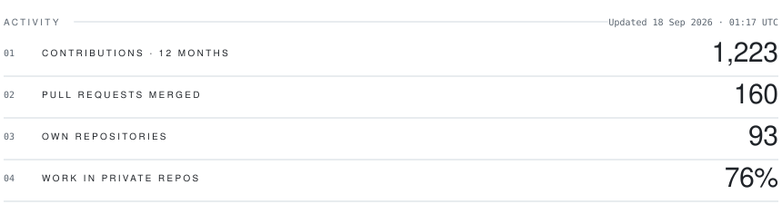
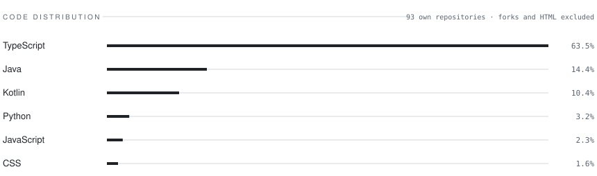

# Carlos G

**Senior Technical Lead · Software Architect**
Bogotá, Colombia · Remote

<a href="README.md">Español</a> · English

---

I design and ship distributed systems on Azure, with AI-driven automation on top.
I also come from UX and educational technology, so I don't treat "it works" and
"someone can actually use it" as separate problems: I write the Bicep for the
environment and the user research that decides what gets built.

**Open to** Software Architecture, AI/GenAI Engineering and Cloud roles.
[LinkedIn](https://www.linkedin.com/in/userpersona/) &nbsp;·&nbsp; [fgoguerra@gmail.com](mailto:fgoguerra@gmail.com)

---

### 01 · Selected work

| Project | What it solves | Stack |
| :-- | :-- | :-- |
| **[n8n-nodes-icd11](https://github.com/Owito/n8n-nodes-icd11)**  [npm](https://www.npmjs.com/package/n8n-nodes-icd11) | Community node exposing the WHO ICD-11 API inside n8n. Shipped with trusted publishing over OIDC: no long-lived tokens in the pipeline. | TypeScript · n8n SDK · OIDC |
| **[Rehabilitación Continua CO](https://github.com/Owito/rehabilitacion-continua-co)**  [live](https://owito.github.io/rehabilitacion-continua-co/) | Directory of continuing education in rehabilitation. Three LLM providers failed the extraction, so the actual mechanism is verified curation over sitemaps. | Astro · TypeScript · CI/CD |
| **[Margoth](https://github.com/Owito/margoth)** | Desktop application for cognitive and language rehabilitation. Fully offline by design: clinical data never leaves the machine. | Python · PyQt6 · Privacy by Design |
| **[PoliMarket](https://github.com/Owito/polimarket-arquitectura)**  [live](https://owito.github.io/polimarket-arquitectura/) | Distributed component architecture with strict layer separation: a framework-free REST API in Go and a CLI client in Rust. | Go · Rust · Render |
| **[NERV UI](https://github.com/Owito/nerv-ui)**  [demo](https://owito.github.io/nerv-ui/) | Open source CSS design system, distributed over CDN under the MIT license. | CSS · Design System · jsDelivr |
| **[Telecom Lab](https://github.com/Owito/telecom-lab)**  [live](https://owito.github.io/telecom-lab/) | Web tooling and auto-grader for subnetting/VLSM, on top of a tested calculation engine. | Astro · TypeScript · Vitest |

---

### 02 · How I work

- **Infrastructure as code, or it doesn't count.** Bicep with a `what-if` pass first,
  Container Apps, secrets through Key Vault with Managed Identity. No secret lives in the repo.
- **12-Factor as an exit criterion.** On the last backend I led, the service went from
  meeting 2 of the 12 factors to 9 before I called it deployable.
- **Security comes before the pentest, not after.** On the last platform I closed
  37 of 41 findings (90%) and validated them in production, not in a document.
- **Tests where they change decisions.** A real pyramid by level, not vanity coverage.
- **Privacy by Design.** When the data is sensitive, processing stays local: Margoth
  and my notes app run AI models fully offline.

---

### 03 · Activity

<picture>
  <source media="(prefers-color-scheme: dark)" srcset="assets/stats-en-dark.svg">
  
</picture>

<picture>
  <source media="(prefers-color-scheme: dark)" srcset="assets/langs-en-dark.svg">
  
</picture>

These cards are generated from the GitHub API and committed to this repository
(<a href="scripts/generate-stats.mjs"><code>scripts/generate-stats.mjs</code></a>), so they don't depend
on any third-party service that can go down. No streaks: most of my work happens in private
client repositories and in delivery cycles, not in daily commits.

---

### 04 · Stack

**Architecture and backend**
TypeScript · Kotlin · Python · Go · Rust · Java · PHP
DDD · Hexagonal architecture · Microservices · REST APIs · 12-Factor

**Cloud, DevOps and IaC**
Azure (Container Apps, PostgreSQL, Key Vault, App Gateway) · Docker · Kubernetes
Bicep · Terraform · Azure DevOps · GitHub Actions · Linux

**AI and automation**
n8n · RAG with pgvector · Multi-agent systems · Claude and Gemini APIs

**Frontend and UX**
Astro · React · Jetpack Compose · JavaScript · CSS · Figma
Nielsen's heuristics · Neurodiversity Design System · Accessibility

---

### 05 · Experience

**Senior Technical Lead · Software Architect** · *current*
GenAI platform architecture on Azure, PostgreSQL migration to managed infrastructure,
hardening and AI automation. From infrastructure design through to the pipeline.

**Senior Instructional Designer and Learning Platforms** · *2020 to 2024*
Educational product and agile delivery at EFAE, Área Andina and FUNDEINCO.

**UX Developer · Orange Mia!** · *2023*
Web development and user-centered research.

---

### 06 · Education

- **MSc in Software Architecture** · Politécnico Grancolombiano · *in progress*
- **BSc in Software Engineering** · Politécnico Grancolombiano
- **MSc in Educational Informatics** · Universidad de La Sabana
- **BSc in Speech and Language Pathology** · Universidad de Pamplona

---

A role, a project, or a second opinion on an architecture?
Reach me at <a href="mailto:fgoguerra@gmail.com">fgoguerra@gmail.com</a> or on
<a href="https://www.linkedin.com/in/userpersona/">LinkedIn</a>.
